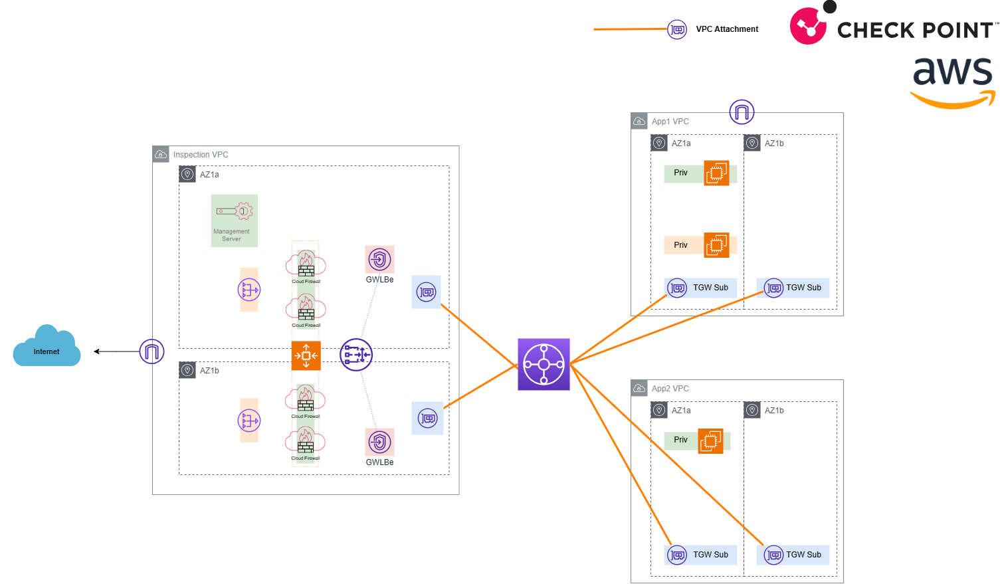

# AWS Check Point Centralized Inspection Lab

This environment deploys a 100% Terraform-based AWS lab for testing Check Point Cloud Firewall inspection patterns:

- Inspection VPC with Check Point Cloud Firewall GWLB stack in 2 AZs (official module).
- 2 client VPCs (App1 and App2) in a single primary AZ.
- Central TGW connecting all 3 VPCs.
- 3 EC2 instances:
  - Linux bastion (public IP) in App1 VPC public subnet.
  - Linux1 (private IP) in App1 VPC private subnet.
  - Linux2 (private IP) in App2 VPC private subnet.

## Architecture Diagram



To edit this diagram, open [drawings/aws-lz-chkp-centralized-inspection.drawio.png](./drawings/aws-lz-chkp-centralized-inspection.drawio.png) with [diagrams.net](https://app.diagrams.net/) (File -> Open From -> GitHub).

## Official Check Point Module

This environment uses:

- `CheckPointSW/cloudguard-network-security/aws//modules/tgw_gwlb_master` version `1.0.10`

Admin guide:

- [Overview of CloudGuard Network for AWS Centralized Gateway Load Balancer](https://sc1.checkpoint.com/documents/IaaS/WebAdminGuides/EN/CP_CloudGuard_Network_for_AWS_Gateway_Load_Balancer_ASG/Default.htm)
- Use this official Check Point guide for deployment patterns, prerequisites, operations, updates, troubleshooting, and GWLB-specific architecture guidance for this design.

## Environment Setup

### GitHub Codespaces (Optional)

This repository includes a dev container configuration in [.devcontainer/devcontainer.json](.devcontainer/devcontainer.json) with both Terraform and AWS CLI features preinstalled. The dev container configuration allows this repository to run from GitHub Codespaces without the need to install Terraform or AWS CLI on your own laptop/workstation to deploy this lab. 

Read here for more information about GitHub Codespaces: [What are GitHub Codespaces?](https://docs.github.com/en/codespaces/about-codespaces/what-are-codespaces).

### AWS CLI Profile Login (Optional)

The dev container installs the tools, but it does not create your AWS login profiles automatically. It's recommended to use AWS SSO to create a dedicated AWS CLI profile named `terraform`.

Using SSO for this lab gives you:

- Better security: no long-lived access keys stored in Terraform files, shell history, or committed by mistake.
- Easier credential rotation: temporary session-based credentials that auto-refresh without manual intervention.
- Cleaner workflows: switch between accounts/environments by changing profile settings, not by rewriting credentials.
- Safer collaboration: teammates can use the same Terraform code with their own SSO profile, avoiding shared static secrets.

**Create the SSO profile with this single command:**

```bash
aws configure sso --profile terraform
```

**When prompted, you will need to provide:**

1. **SSO session name** - Enter any name for this session (e.g., `terraform`)
2. **SSO start URL** - Find this in your AWS portal:
   - Navigate to your **AWS SSO console** or AWS accounts page
   - Look for the **Start URL** (typically something like `https://my-org.awsapps.com/start`)
   - Copy and paste it here
3. **SSO region** - Find this in your AWS portal:
   - In the same AWS SSO console, check the **Region** setting (typically `us-east-1`)
   - Enter this region
4. **AWS account and role selection** - Your browser will open for authentication. Select your AWS account and the appropriate role (e.g., `AdministratorAccess` or your organization's equivalent)
5. **Default region** - Enter `eu-west-1` (or your preferred region)
6. **Output format** - Leave blank or enter `json`

**After setup, verify the profile works:**

```bash
aws sts get-caller-identity --profile terraform
```

Keep `aws_profile = "terraform"` in `terraform.tfvars` and use Terraform normally. Your AWS credentials will automatically refresh through the SSO flow when needed.

### Create SSH Key Pair

Create one SSH key pair before deployment. This same key pair is used to connect to all EC2 instances in this lab, including:

- Check Point management server
- Bastion host
- Linux1 and Linux2 instances

Generate a key pair on Linux/macOS:

```bash
mkdir -p keys
ssh-keygen -t rsa -b 4096 -f keys/lab-key -N "" -C "aws-lz-chkp-lab"
```

This creates:

- Private key: `keys/lab-key`
- Public key: `keys/lab-key.pub`

Set secure permissions on the private key:

```bash
chmod 600 keys/lab-key
```

Terraform reads the public key from `keys/lab-key.pub` by default (via `public_key_path`).

## Quick Start

### Deployment Instructions

1. Copy and edit tfvars:

```bash
cp terraform.tfvars.example terraform.tfvars
```

1. Paste your public key into `keys/lab-key.pub` (or change `public_key_path`).

1. Set required values in `terraform.tfvars`:

- `bastion_allowed_cidr`
- `checkpoint_admin_cidr`
- `checkpoint_gateway_sic_key`

1. Set AWS profile in `terraform.tfvars`:

- `aws_profile = "your-profile-name"`

This lab uses the AWS provider `profile` setting, so Terraform reads credentials from your local AWS CLI profile without needing to prefix every command with `AWS_PROFILE=...`.

4. Initialize and validate:

```bash
terraform init
terraform validate
```

1. Deploy:

```bash
terraform plan -out=tfplan
terraform apply tfplan
```

### Connect Through Bastion

After deployment, use the same private key (`keys/lab-key`) to access the bastion and then the private client machines.

1. Get instance IPs from Terraform outputs:

```bash
terraform output linux_bastion_public_ip
terraform output linux1_private_ip
terraform output linux2_private_ip
```

1. Save bastion public IP to a shell variable:

```bash
BASTION_IP=$(terraform output -raw linux_bastion_public_ip)
```

1. Connect to the bastion host from your terminal:

```bash
ssh -i keys/lab-key ec2-user@"$BASTION_IP"
```

1. From inside the bastion, connect to the private client machines:

```bash
ssh linux1
ssh linux2
```

The bastion is preconfigured with these host aliases in `/home/ec2-user/.ssh/config`, so you do not need to type private IP addresses manually.

If needed, you can also connect by private IP from bastion:

```bash
ssh ec2-user@<linux1_private_ip>
ssh ec2-user@<linux2_private_ip>
```

Notes:

- SSH username for Amazon Linux 2023 instances is `ec2-user`.
- Ensure `bastion_allowed_cidr` in `terraform.tfvars` includes your current public source IP; otherwise SSH to bastion will fail.

## Notes

- Default region is `eu-west-1`; override via `aws_region`.
- The Check Point module controls internal inspection-VPC subnet behavior.
- Dedicated management subnet placement in AZ1 is not exposed as an explicit input in this module version; management is deployed by the module according to its internal logic.
